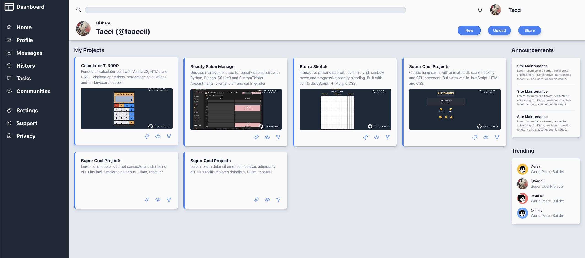

# Admin Dashboard

> A fully functional admin dashboard built with HTML and CSS, using CSS Grid as the primary layout tool.

---

## 🔗 Live Demo

**Live Demo:** [taaccii.github.io/admin-dashboard](https://taaccii.github.io/admin-dashboard/)

---

## ✨ Features

- **CSS Grid layout** — full page structure built with nested grids (container, header, sidebar, main content)
- **Dark sidebar** — navigation with SVG icons from Phosphor Icons, hover effects and active states
- **Header** — search bar, user info, notification bell and action buttons
- **Project cards** — with live demo and repo links, hover lift effect with accent shadow and action buttons
- **Custom design** — personal color scheme inspired by my Landing Page project
- **CSS Custom Properties** — fully themed with variables for colors, shadows and border radius
- **Josh Comeau shadow palette** — realistic multi-layer shadows with HSL color tinting
- **Responsive** — sidebar collapses to icons on mobile, single column layout on small screens
- **Hover & active animations** — cards lift on hover, buttons press on active with `translateY`

---

## 🛠️ Tech Stack

| Component | Technology |
|-----------|------------|
| **Markup** | HTML5 |
| **Style** | CSS3 |
| **Layout** | CSS Grid + Flexbox |
| **Icons** | Phosphor Icons (SVG inline) |
| **Font** | Google Fonts — Roboto |
| **Shadows** | Josh Comeau Shadow Palette |

---

## 💡 What I Learned

- Building complex layouts with nested CSS Grid containers
- Combining Grid for page structure and Flexbox for component internals
- Using `grid-template-areas` and explicit `grid-column` / `grid-row` placement
- Managing SVG icons inline with `currentColor` for CSS color control
- Creating realistic shadows with HSL color tinting instead of plain black
- CSS Custom Properties for consistent theming across the entire project
- `object-fit: cover` for responsive image previews inside fixed containers
- `-webkit-line-clamp` for multiline text truncation
- Responsive design with `minmax()`, `auto-fit` and media queries

---

## 📝 Notes

This was the most complex CSS project I have built so far. Getting the nested grid layout right — especially the sidebar spanning both rows while the header and main content sat in separate rows — required a solid understanding of how grid placement works. The hardest part was the responsive behaviour: making the sidebar collapse to icons on mobile while keeping the layout functional took several iterations. I designed my own color scheme instead of copying the reference, which pushed me to think about contrast, hierarchy and consistency across the whole UI.

---

## 📄 License

This project is licensed under the **MIT License** — see [`LICENSE`](./LICENSE) for details.

---

## 👨‍💻 Author

**Taaccii**

- 📧 [taccidev@gmail.com](mailto:taccidev@gmail.com)
- 🐙 GitHub: [@Taaccii](https://github.com/Taaccii)
- 💼 LinkedIn: [alessandro-barletta-dev](https://linkedin.com/in/alessandro-barletta-dev)

---

> *Project built as part of [The Odin Project](https://www.theodinproject.com/lessons/node-path-intermediate-html-and-css-admin-dashboard) Intermediate HTML and CSS curriculum.*